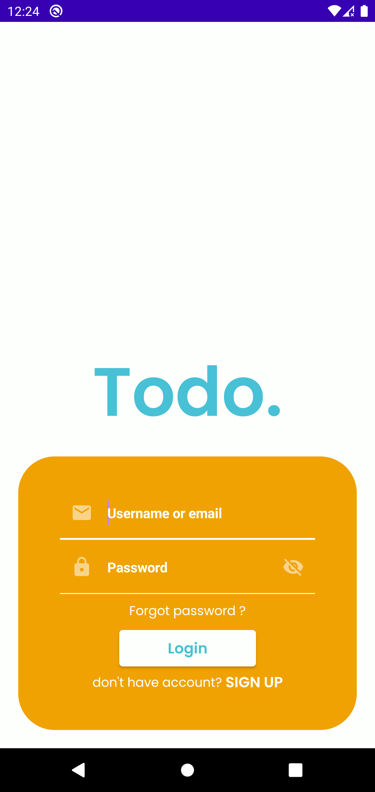
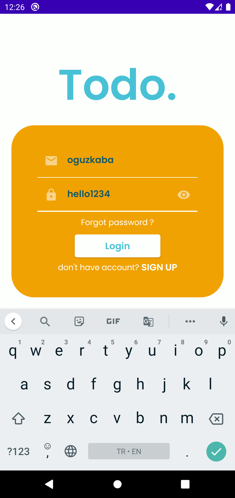
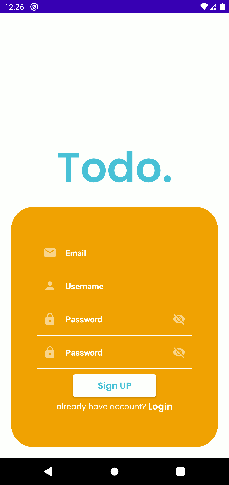
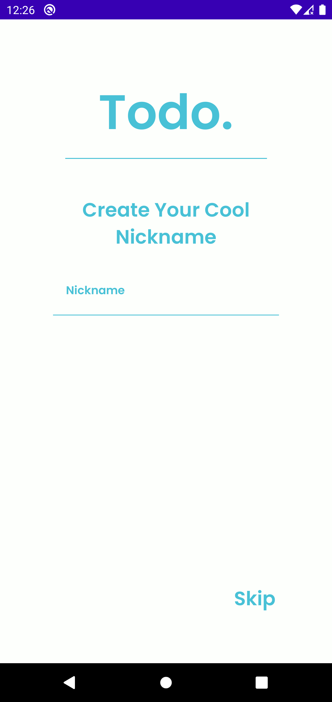
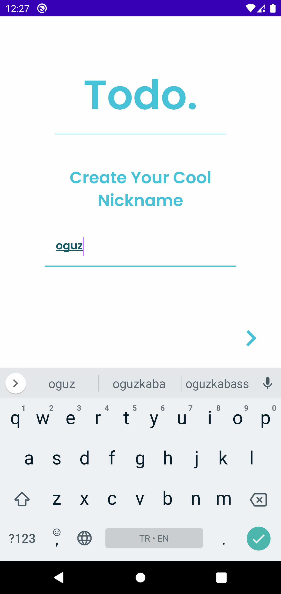
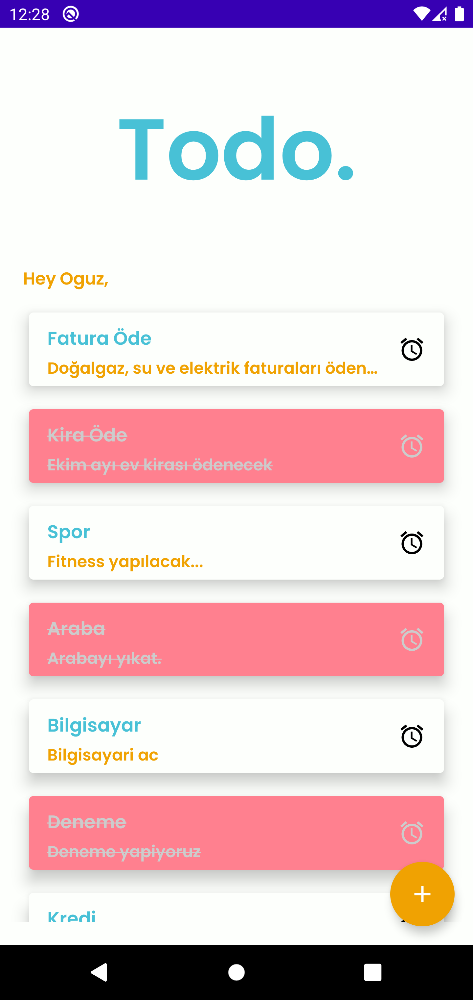
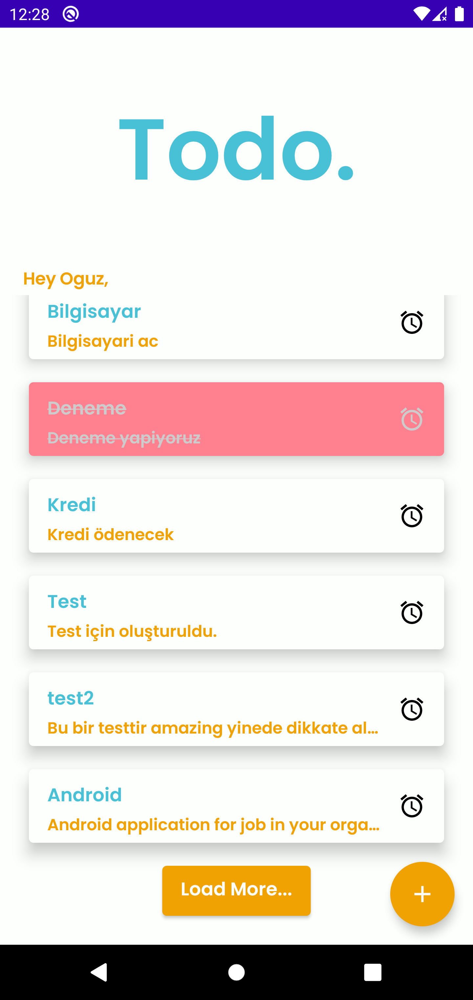
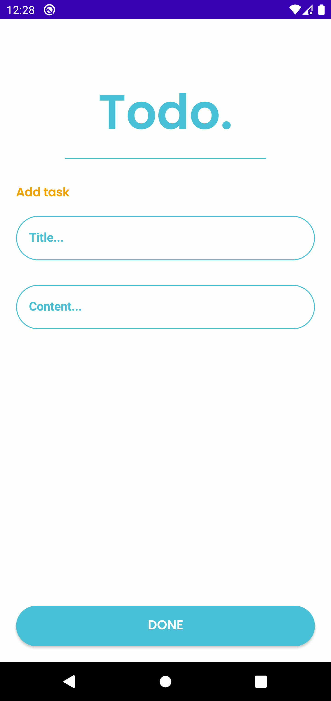

# TODO.
## ScreenShots

      
      

## Android Development

TODO. is an app that attempts to use the latest cutting edge libraries and tools. As a summary:

 * Entirely written in [Kotlin](https://kotlinlang.org/).
 * UI completely written in [Jetpack Compose](https://developer.android.com/jetpack/compose).
 * Uses [Kotlin Coroutines](https://kotlinlang.org/docs/reference/coroutines/coroutines-guide.html) throughout.
 * Uses [Hilt](https://dagger.dev/hilt/) for dependency injection
 
 ###  RestAPI / API Key
 
 * Retrofit2 for restAPI connection (Node.js-MySQL)
